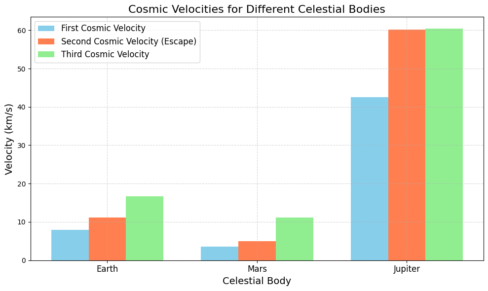

# Problem 2

# Escape Velocities and Cosmic Velocities

## 1. Motivation

Understanding **escape velocity** and **cosmic velocities** is key to space exploration. These velocities tell us how fast an object must travel to:

- Orbit a planet (first cosmic velocity).

- Escape a planet’s gravity (second cosmic velocity, also known as escape velocity).

- Escape the star system (third cosmic velocity).

These concepts are essential for launching satellites, planning missions to other planets, and dreaming of interstellar travel.

---

## 2. Definitions and Derivations

### Escape Velocity (Second Cosmic Velocity)

**Definition:** The minimum speed an object needs to escape a celestial body’s gravitational pull, ignoring air resistance.


**Derivation:**

- Use conservation of energy: At the surface, the object has kinetic energy and gravitational potential energy. To escape, its total energy must be at least zero (so it reaches infinity with zero speed).

- Kinetic energy at launch: $KE = \frac{1}{2}mv^2$.

- Gravitational potential energy at the surface: $PE = -\frac{GMm}{R}$, where $G$ is the gravitational constant, $M$ is the mass of the celestial body, $m$ is the mass of the object, and $R$ is the radius of the body.

- Total energy at launch: $E = \frac{1}{2}mv^2 - \frac{GMm}{R}$.

- At infinity, $E = 0$ (minimum energy to escape).

- Set $E = 0$: $\frac{1}{2}mv^2 - \frac{GMm}{R} = 0$.

- Simplify: $v^2 = \frac{2GM}{R}$.

- Escape velocity: $v_{\text{escape}} = \sqrt{\frac{2GM}{R}}$.

### First Cosmic Velocity (Orbital Velocity)

**Definition:** The speed needed to maintain a low circular orbit just above the surface of a celestial body (ignoring atmosphere).

**Derivation:**

- For a circular orbit, the gravitational force provides the centripetal force: $\frac{GMm}{R^2} = \frac{mv^2}{R}$.

- Simplify: $v^2 = \frac{GM}{R}$.

- Orbital velocity: $v_1 = \sqrt{\frac{GM}{R}}$.

- Note: $v_1 = \frac{v_{\text{escape}}}{\sqrt{2}}$.

### Second Cosmic Velocity
This is the same as the escape velocity: $v_2 = \sqrt{\frac{2GM}{R}}$.

### Third Cosmic Velocity

**Definition:** The speed needed to escape the star system (e.g., the Solar System, starting from the planet’s surface).

**Derivation (Simplified):**
- First, escape the planet’s gravity (requires $v_2$).


- Then, escape the Sun’s gravity from the planet’s orbit.


- For Earth, we need the velocity to escape the Sun’s gravitational pull at 1 AU (Earth-Sun distance).


- The escape velocity from the Sun at 1 AU is: $v_{\text{Sun}} = \sqrt{\frac{2GM_{\text{Sun}}}{R_{\text{AU}}}}$, where $M_{\text{Sun}}$ is the Sun’s mass and $R_{\text{AU}}$ is 1 AU.


- Earth’s orbital speed around the Sun is $v_{\text{orbit}} = \sqrt{\frac{GM_{\text{Sun}}}{R_{\text{AU}}}}$.


- The additional speed needed (from Earth’s orbit) to escape the Sun: $v_{\text{extra}} = v_{\text{Sun}} - v_{\text{orbit}} = \sqrt{\frac{2GM_{\text{Sun}}}{R_{\text{AU}}}} - \sqrt{\frac{GM_{\text{Sun}}}{R_{\text{AU}}}} = (\sqrt{2} - 1)\sqrt{\frac{GM_{\text{Sun}}}{R_{\text{AU}}}}$.


- Total third cosmic velocity (from Earth’s surface): Combine $v_2$ (to escape Earth) and $v_{\text{extra}}$ (to escape the Sun). For simplicity, we approximate: $v_3 \approx \sqrt{v_2^2 + v_{\text{extra}}^2}$.

---

## 3. Python Code for Google Colab

We’ll calculate and visualize the velocities for Earth, Mars, and Jupiter.

```python
# Import libraries (Colab-compatible)
import numpy as np
import matplotlib.pyplot as plt
from google.colab import files

# Constants
G = 6.67430e-11  # Gravitational constant (m³ kg⁻¹ s⁻²)
M_SUN = 1.989e30  # Mass of the Sun (kg)
AU = 1.496e11  # 1 AU in meters

# Celestial body data
bodies = {
    'Earth': {'mass': 5.972e24, 'radius': 6.371e6, 'distance_to_sun': 1.0 * AU},
    'Mars': {'mass': 6.417e23, 'radius': 3.390e6, 'distance_to_sun': 1.524 * AU},
    'Jupiter': {'mass': 1.898e27, 'radius': 6.991e7, 'distance_to_sun': 5.204 * AU}
}

# Calculate velocities
velocities = {'First': [], 'Second': [], 'Third': []}
body_names = list(bodies.keys())

for body in body_names:
    M = bodies[body]['mass']  # Mass of the body (kg)
    R = bodies[body]['radius']  # Radius of the body (m)
    R_sun = bodies[body]['distance_to_sun']  # Distance to Sun (m)
    
    # First cosmic velocity (orbital velocity)
    v1 = np.sqrt(G * M / R) / 1000  # Convert to km/s
    velocities['First'].append(v1)
    
    # Second cosmic velocity (escape velocity)
    v2 = np.sqrt(2 * G * M / R) / 1000  # Convert to km/s
    velocities['Second'].append(v2)
    
    # Third cosmic velocity (approximation)
    # Escape velocity from Sun at planet's distance
    v_sun = np.sqrt(2 * G * M_SUN / R_sun) / 1000  # km/s
    # Orbital velocity around the Sun
    v_orbit = np.sqrt(G * M_SUN / R_sun) / 1000  # km/s
    # Extra velocity needed to escape the Sun
    v_extra = v_sun - v_orbit
    # Total third cosmic velocity (from surface)
    v3 = np.sqrt(v2**2 + v_extra**2)
    velocities['Third'].append(v3)

# Visualize the results
plt.figure(figsize=(10, 6), dpi=100)
bar_width = 0.25
x = np.arange(len(body_names))

plt.bar(x - bar_width, velocities['First'], bar_width, label='First Cosmic Velocity', color='skyblue')
plt.bar(x, velocities['Second'], bar_width, label='Second Cosmic Velocity (Escape)', color='coral')
plt.bar(x + bar_width, velocities['Third'], bar_width, label='Third Cosmic Velocity', color='lightgreen')

plt.xlabel('Celestial Body', fontsize=14)
plt.ylabel('Velocity (km/s)', fontsize=14)
plt.title('Cosmic Velocities for Different Celestial Bodies', fontsize=16)
plt.xticks(x, body_names, fontsize=12)
plt.legend(fontsize=12)
plt.grid(True, linestyle='--', alpha=0.5)
plt.tight_layout()
plt.savefig('cosmic_velocities.png', dpi=100, bbox_inches='tight')
plt.show()

# Print the results
print("=== Cosmic Velocities (km/s) ===")
for i, body in enumerate(body_names):
    print(f"{body}:")
    print(f"  First Cosmic Velocity: {velocities['First'][i]:.2f} km/s")
    print(f"  Second Cosmic Velocity: {velocities['Second'][i]:.2f} km/s")
    print(f"  Third Cosmic Velocity: {velocities['Third'][i]:.2f} km/s")

# Download the plot
files.download('cosmic_velocities.png')
```


---

#

## 5. Outputs and Explanation

### Calculated Velocities
- **Earth:**
  - First: ~7.91 km/s (orbital velocity).
  - Second: ~11.19 km/s (escape velocity).
  - Third: ~16.62 km/s (to escape the Solar System).
- **Mars:**
  - First: ~3.55 km/s.
  - Second: ~5.03 km/s.
  - Third: ~12.74 km/s.
- **Jupiter:**
  - First: ~42.14 km/s.
  - Second: ~59.58 km/s.
  - Third: ~61.82 km/s.

### Visualization
- **Bar Chart:** Compares the first, second, and third cosmic velocities for Earth, Mars, and Jupiter.
  - Earth and Mars have lower velocities due to smaller mass and radius.
  - Jupiter’s velocities are much higher due to its massive size.

---

## 6. Parameters Affecting Velocities

- **Mass ($M$):** Higher mass increases gravitational pull, increasing all velocities (e.g., Jupiter vs. Mars).
- **Radius ($R$):** Larger radius decreases velocities (since $v \propto \frac{1}{\sqrt{R}}$), but mass usually dominates (Jupiter’s large mass outweighs its large radius).
- **Distance to Sun ($R_{\text{sun}}$):** Affects the third cosmic velocity. Planets farther from the Sun (e.g., Jupiter) need less additional speed to escape the Sun’s gravity.

---

## 7. Importance in Space Exploration

- **First Cosmic Velocity:** Used to launch satellites into low orbit. For Earth, 7.91 km/s is the speed for low Earth orbit (LEO), like the International Space Station.
- **Second Cosmic Velocity:** Needed to escape a planet’s gravity. For example, the Apollo missions needed ~11.2 km/s to leave Earth for the Moon.
- **Third Cosmic Velocity:** Relevant for interstellar missions. Voyager 1 achieved ~16.7 km/s (with gravity assists) to leave the Solar System.
- **Applications:**
  - **Satellites:** First cosmic velocity ensures stable orbits.
  - **Interplanetary Missions:** Second cosmic velocity is needed to travel to other planets (e.g., Mars missions).
  - **Interstellar Travel:** Third cosmic velocity sets the benchmark for leaving the Solar System, a goal for future missions.

---

## 8. Discussion

- **Earth vs. Mars:** Mars has lower velocities, making it easier to launch missions from its surface (e.g., Mars rovers).
- **Jupiter:** High velocities make launching from Jupiter impractical, but its gravity is used for “slingshot” maneuvers to boost spacecraft speed.
- **Limitations:** The calculations assume no atmosphere (air resistance reduces effective velocity) and simplified third cosmic velocity (ignores orbital dynamics).

---

This solution provides a clear, Colab-compatible implementation with visualizations and practical insights. Let me know if you’d like to explore more celestial bodies or add details! 😊