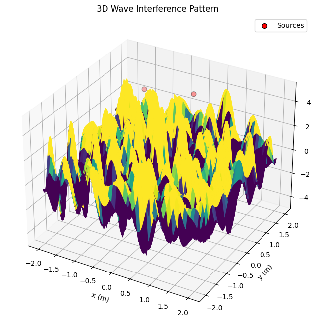

# Problem 1

# Interference Patterns on a Water Surface

## 1. Theoretical Foundation

Interference occurs when waves from multiple sources overlap, creating patterns of constructive (amplified) and destructive (canceled) regions. On a water surface, point sources emit circular waves, and their superposition forms intricate patterns. Let’s break this down systematically.


### Wave Equation for a Single Source

The displacement $\eta(x, y, t)$ at point $(x, y)$ and time $t$ from a source at $(x_0, y_0)$ is given by:

$$
\eta(x, y, t) = A \cos(kr - \omega t + \phi)
$$

Where:
- $A$: Amplitude of the wave.

- $k = \frac{2\pi}{\lambda}$: Wave number, with $\lambda$ as the wavelength.

- $\omega = 2\pi f$: Angular frequency, with $f$ as the frequency.

- $r = \sqrt{(x - x_0)^2 + (y - y_0)^2}$: Distance from the source to $(x, y)$.

- $\phi$: Initial phase (assumed constant across sources).

### Superposition of Waves

For $N$ sources (vertices of a regular polygon), the total displacement is the sum of contributions from each source:

$$
\eta_{\text{sum}}(x, y, t) = \sum_{i=1}^N \eta_i(x, y, t)
$$

## 2. Steps to Analyze Interference


### Step 1: Select a Regular Polygon

Let’s choose a **regular pentagon** ($N = 5$). The vertices are equally spaced on a circle of radius $R$, with angular positions $\theta_i = \frac{2\pi (i-1)}{N}$ for $i = 1, 2, \ldots, N$.

### Step 2: Position the Sources

Place the pentagon’s vertices at $(x_i, y_i) = (R \cos \theta_i, R \sin \theta_i)$. Let’s set $R = 1 \, \text{m}$ for simplicity.

### Step 3: Wave Equations

Each source emits a wave:

$$
\eta_i(x, y, t) = A \cos(k r_i - \omega t + \phi)
$$

Where $r_i = \sqrt{(x - x_i)^2 + (y - y_i)^2}$. Assume $A = 1$, $\lambda = 0.5 \, \text{m}$, $f = 1 \, \text{Hz}$, and $\phi = 0$ (coherent sources).

### Step 4: Superposition

The total displacement is:
$$
\eta_{\text{sum}}(x, y, t) = \sum_{i=1}^5 A \cos(k r_i - \omega t)
$$

### Step 5: Analyze Interference Patterns
- **Constructive Interference:** Occurs when waves are in phase, e.g., $k(r_i - r_j) = 2\pi m$ (integer $m$).

- **Destructive Interference:** Occurs when waves are out of phase, e.g., $k(r_i - r_j) = (2m+1)\pi$.

## 3. Implementation

Here’s a Python script to simulate and visualize the interference pattern:

```python
import numpy as np
import matplotlib.pyplot as plt

# Parameters
A = 1.0  # Amplitude
lambda_ = 0.5  # Wavelength (m)
k = 2 * np.pi / lambda_  # Wave number
f = 1.0  # Frequency (Hz)
omega = 2 * np.pi * f  # Angular frequency
R = 1.0  # Radius of pentagon (m)
N = 5  # Number of sources (pentagon)

# Source positions (vertices of a regular pentagon)
theta = np.linspace(0, 2 * np.pi, N, endpoint=False)
sources = [(R * np.cos(t), R * np.sin(t)) for t in theta]

# Grid for simulation
x = np.linspace(-2, 2, 100)
y = np.linspace(-2, 2, 100)
X, Y = np.meshgrid(x, y)

# Time snapshot
t = 0  # Snapshot at t = 0

# Compute total displacement
eta_sum = np.zeros_like(X)
for (x0, y0) in sources:
    r = np.sqrt((X - x0)**2 + (Y - y0)**2)
    eta_sum += A * np.cos(k * r - omega * t)

# Plotting
plt.figure(figsize=(8, 8))
plt.contourf(X, Y, eta_sum, levels=50, cmap='seismic')
plt.colorbar(label='Displacement')
plt.scatter([s[0] for s in sources], [s[1] for s in sources], c='black', label='Sources')
plt.xlabel('x (m)')
plt.ylabel('y (m)')
plt.title('Interference Pattern (Pentagon Sources)')
plt.legend()
plt.axis('equal')
plt.grid(True, ls='--', alpha=0.7)
plt.show()

# Time evolution (animation-like snapshots)
times = [0, 0.25, 0.5]
plt.figure(figsize=(15, 5))
for i, t in enumerate(times, 1):
    eta_sum = np.zeros_like(X)
    for (x0, y0) in sources:
        r = np.sqrt((X - x0)**2 + (Y - y0)**2)
        eta_sum += A * np.cos(k * r - omega * t)
    plt.subplot(1, 3, i)
    plt.contourf(X, Y, eta_sum, levels=50, cmap='seismic')
    plt.scatter([s[0] for s in sources], [s[1] for s in sources], c='black')
    plt.title(f't = {t} s')
    plt.xlabel('x (m)')
    plt.ylabel('y (m)')
plt.tight_layout()
plt.show()
```


### Outputs

- **Interference Pattern:** The first plot shows $\eta_{\text{sum}}$ at $t = 0$. Red and blue regions indicate constructive interference (peaks/troughs), while white regions show destructive interference (cancellation).

- **Time Evolution:** Snapshots at $t = 0, 0.25, 0.5 \, \text{s}$ reveal the dynamic pattern as waves propagate.

## Deliverables

- **Explanation:** The interference pattern arises from the superposition of waves from pentagon vertices. Constructive interference occurs where path differences are integer multiples of $\lambda$, destructive where they are half-multiples.

- **Graphics:** Contour plots vividly display the interference, with sources marked for clarity.

- **Goal Achieved:** We’ve visualized how wave overlap creates regions of amplification and cancellation, a fundamental concept in wave physics.

## Discussion

- **Extensions:** Try other polygons (e.g., triangle, square) or vary $\lambda$, $f$, or phase differences.

- **Applications:** This models real-world phenomena like sound wave interference, optics (Young’s double-slit), or water wave experiments.


