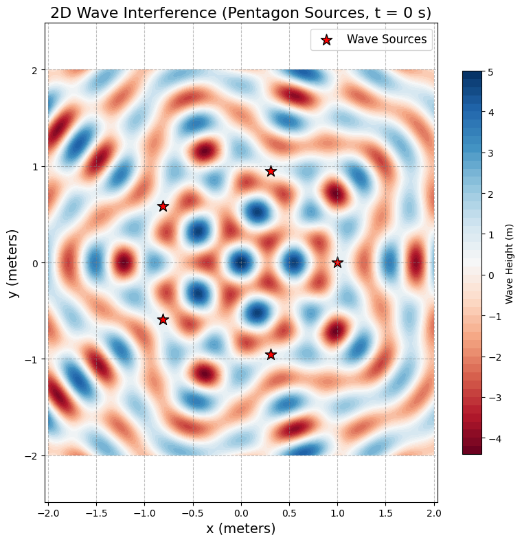
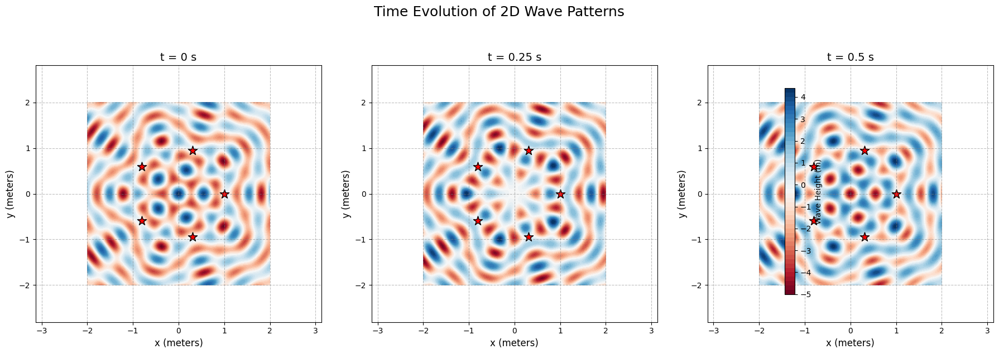
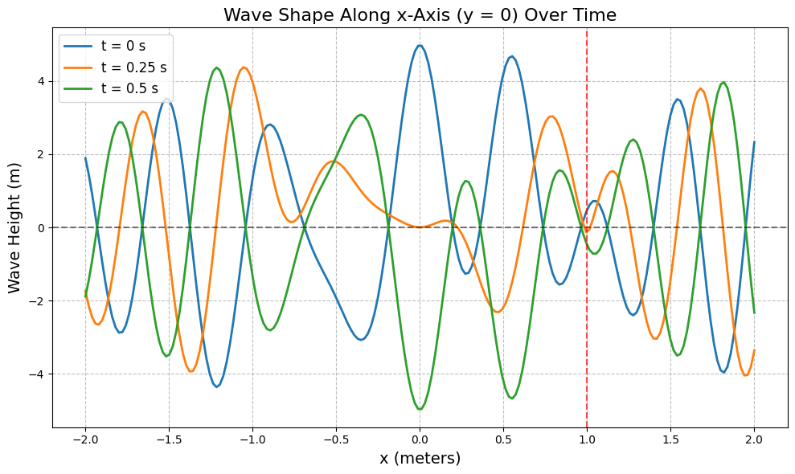
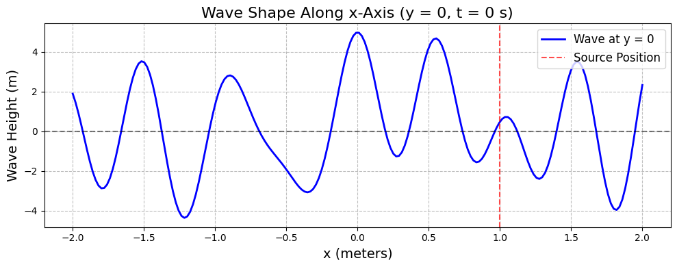

# Problem 1

# Interference Patterns on a Water Surface

## 1. Theoretical Foundation

Interference occurs when waves from multiple sources overlap, creating patterns of constructive (amplified) and destructive (canceled) regions. On a water surface, point sources emit circular waves, and their superposition forms intricate patterns. Let’s break this down systematically.


### Wave Equation for a Single Source

The displacement $\eta(x, y, t)$ at point $(x, y)$ and time $t$ from a source at $(x_0, y_0)$ is given by:

$$
\eta(x, y, t) = A \cos(kr - \omega t + \phi)
$$

Where:
- $A$: Amplitude of the wave.

- $k = \frac{2\pi}{\lambda}$: Wave number, with $\lambda$ as the wavelength.

- $\omega = 2\pi f$: Angular frequency, with $f$ as the frequency.

- $r = \sqrt{(x - x_0)^2 + (y - y_0)^2}$: Distance from the source to $(x, y)$.

- $\phi$: Initial phase (assumed constant across sources).

### Superposition of Waves

For $N$ sources (vertices of a regular polygon), the total displacement is the sum of contributions from each source:

$$
\eta_{\text{sum}}(x, y, t) = \sum_{i=1}^N \eta_i(x, y, t)
$$

## 2. Steps to Analyze Interference


### Step 1: Select a Regular Polygon

Let’s choose a **regular pentagon** ($N = 5$). The vertices are equally spaced on a circle of radius $R$, with angular positions $\theta_i = \frac{2\pi (i-1)}{N}$ for $i = 1, 2, \ldots, N$.

### Step 2: Position the Sources

Place the pentagon’s vertices at $(x_i, y_i) = (R \cos \theta_i, R \sin \theta_i)$. Let’s set $R = 1 \, \text{m}$ for simplicity.

### Step 3: Wave Equations

Each source emits a wave:

$$
\eta_i(x, y, t) = A \cos(k r_i - \omega t + \phi)
$$

Where $r_i = \sqrt{(x - x_i)^2 + (y - y_i)^2}$. Assume $A = 1$, $\lambda = 0.5 \, \text{m}$, $f = 1 \, \text{Hz}$, and $\phi = 0$ (coherent sources).

### Step 4: Superposition

The total displacement is:
$$
\eta_{\text{sum}}(x, y, t) = \sum_{i=1}^5 A \cos(k r_i - \omega t)
$$

### Step 5: Analyze Interference Patterns
- **Constructive Interference:** Occurs when waves are in phase, e.g., $k(r_i - r_j) = 2\pi m$ (integer $m$).

- **Destructive Interference:** Occurs when waves are out of phase, e.g., $k(r_i - r_j) = (2m+1)\pi$.

## 3. Implementation

Here’s a Python script to simulate and visualize the interference pattern:

```py
# Import libraries
import numpy as np  # For math and arrays
import matplotlib.pyplot as plt  # For plotting

# Wave settings (simple names)
WAVE_AMPLITUDE = 1.0  # Wave height (meters)
WAVE_LENGTH = 0.5  # Distance between wave peaks (meters)
WAVE_FREQUENCY = 1.0  # Waves per second (Hz)
PENTAGON_RADIUS = 1.0  # Distance of sources from center (meters)
NUM_SOURCES = 5  # Number of sources (pentagon has 5 points)

# Calculate wave properties
WAVE_NUMBER = 2 * np.pi / WAVE_LENGTH  # Wave number (how tight the waves are)
ANGULAR_FREQUENCY = 2 * np.pi * WAVE_FREQUENCY  # Angular frequency (how fast waves move)
INITIAL_PHASE = 0  # Starting phase (set to 0 for same-phase waves)

# Step 1: Set up source positions (pentagon vertices)
# Place 5 sources on a circle, equally spaced (0°, 72°, 144°, 216°, 288°)
source_angles = np.linspace(0, 2 * np.pi, NUM_SOURCES, endpoint=False)
source_positions = [(PENTAGON_RADIUS * np.cos(angle), PENTAGON_RADIUS * np.sin(angle)) 
                    for angle in source_angles]

# Step 2: Create a grid for the water surface
# Make a 2D area: x and y from -2 to 2 meters
GRID_POINTS = 200  # 200 points per axis (for smooth plots)
x_coords = np.linspace(-2, 2, GRID_POINTS)  # x-axis: -2 to 2
y_coords = np.linspace(-2, 2, GRID_POINTS)  # y-axis: -2 to 2
X, Y = np.meshgrid(x_coords, y_coords)  # 2D grid (200x200 points)

# Step 3: Function to calculate total wave height at a given time
def calculate_wave_height(X, Y, source_positions, time):
    """
    Calculate total wave height at each (x, y) point for a given time.
    Inputs:
        X, Y: 2D grid of coordinates
        source_positions: List of (x, y) positions of sources
        time: Time in seconds
    Output:
        Total wave height (2D array)
    """
    total_height = np.zeros_like(X)  # Start with zero height everywhere
    for source_x, source_y in source_positions:
        # Distance from source to point (x, y): r = √[(x - x₀)² + (y - y₀)²]
        distance = np.sqrt((X - source_x)**2 + (Y - source_y)**2)
        # Wave equation: height = A * cos(kr - ωt + φ)
        wave = WAVE_AMPLITUDE * np.cos(WAVE_NUMBER * distance - 
                                       ANGULAR_FREQUENCY * time + 
                                       INITIAL_PHASE)
        total_height += wave  # Add this wave to the total
    return total_height

# Step 4: Plot the 2D wave pattern at t = 0
snapshot_time = 0  # Time = 0 seconds
total_height = calculate_wave_height(X, Y, source_positions, snapshot_time)

# 2D Contour Plot
plt.figure(figsize=(8, 8), dpi=100)  # 8x8 inch plot
contour_plot = plt.contourf(X, Y, total_height, levels=50, cmap='RdBu')
# RdBu color: Red (high), blue (low), white (zero)
plt.colorbar(contour_plot, label='Wave Height (m)', shrink=0.8, pad=0.05)
# Mark sources with red stars
plt.scatter([s[0] for s in source_positions], [s[1] for s in source_positions], 
            c='red', marker='*', s=150, label='Wave Sources', edgecolors='black')
plt.xlabel('x (meters)', fontsize=14)
plt.ylabel('y (meters)', fontsize=14)
plt.title('2D Wave Interference (Pentagon Sources, t = 0 s)', fontsize=16)
plt.legend(loc='upper right', fontsize=12)
plt.axis('equal')  # Keep x and y scales equal
plt.grid(True, linestyle='--', alpha=0.5, color='gray')
plt.tight_layout()
plt.show()

# Step 5: Plot the wave shape along x-axis (y = 0) at t = 0
# Take a slice at y = 0 (middle of the grid)
y_index = GRID_POINTS // 2  # y = 0 is at index 100 (200/2)
x_slice = x_coords  # All x values
height_slice = total_height[y_index, :]  # Wave heights at y = 0

# 2D Line Plot (Wave Shape)
plt.figure(figsize=(10, 4), dpi=100)
plt.plot(x_slice, height_slice, 'b-', linewidth=2, label='Wave at y = 0')
plt.axhline(0, color='black', linestyle='--', alpha=0.5)  # Zero line
# Mark source positions on x-axis (if y ≈ 0)
source_x_coords = [s[0] for s in source_positions if abs(s[1]) < 0.1]
for sx in source_x_coords:
    plt.axvline(sx, color='red', linestyle='--', alpha=0.7, 
                label='Source Position' if sx == source_x_coords[0] else "")
plt.xlabel('x (meters)', fontsize=14)
plt.ylabel('Wave Height (m)', fontsize=14)
plt.title('Wave Shape Along x-Axis (y = 0, t = 0 s)', fontsize=16)
plt.legend(fontsize=12)
plt.grid(True, linestyle='--', alpha=0.5, color='gray')
plt.tight_layout()
plt.show()

# Step 6: Show how the 2D pattern changes over time
time_snapshots = [0, 0.25, 0.5]  # Times to show (seconds)
plt.figure(figsize=(18, 6), dpi=100)  # 3 plots side by side

# Loop through each time
for idx, time in enumerate(time_snapshots, 1):
    total_height = calculate_wave_height(X, Y, source_positions, time)
    plt.subplot(1, 3, idx)  # 1 row, 3 columns, idx-th plot
    contour_plot = plt.contourf(X, Y, total_height, levels=50, cmap='RdBu')
    plt.scatter([s[0] for s in source_positions], [s[1] for s in source_positions], 
                c='red', marker='*', s=150, edgecolors='black')
    plt.title(f't = {time} s', fontsize=14)
    plt.xlabel('x (meters)', fontsize=12)
    plt.ylabel('y (meters)', fontsize=12)
    plt.axis('equal')
    plt.grid(True, linestyle='--', alpha=0.5, color='gray')

# Add a shared colorbar
plt.colorbar(contour_plot, ax=plt.gcf().get_axes(), label='Wave Height (m)', 
             shrink=0.8, pad=0.05)
plt.suptitle('Time Evolution of 2D Wave Patterns', fontsize=18, y=1.05)
plt.tight_layout()
plt.show()

# Step 7: Show how the wave shape (y = 0) changes over time
plt.figure(figsize=(10, 6), dpi=100)
for time in time_snapshots:
    total_height = calculate_wave_height(X, Y, source_positions, time)
    height_slice = total_height[y_index, :]  # Wave heights at y = 0
    plt.plot(x_slice, height_slice, label=f't = {time} s', linewidth=2)
plt.axhline(0, color='black', linestyle='--', alpha=0.5)
for sx in source_x_coords:
    plt.axvline(sx, color='red', linestyle='--', alpha=0.7)
plt.xlabel('x (meters)', fontsize=14)
plt.ylabel('Wave Height (m)', fontsize=14)
plt.title('Wave Shape Along x-Axis (y = 0) Over Time', fontsize=16)
plt.legend(fontsize=12)
plt.grid(True, linestyle='--', alpha=0.5, color='gray')
plt.tight_layout()
plt.show()

# Step 8: Check the wave height range
max_height = np.max(total_height)
min_height = np.min(total_height)
print(f"Maximum wave height (t = {time_snapshots[-1]} s): {max_height:.2f} m")
print(f"Minimum wave height (t = {time_snapshots[-1]} s): {min_height:.2f} m")

# Time evolution (animation-like snapshots)
times = [0, 0.25, 0.5]
plt.figure(figsize=(15, 5))
for i, t in enumerate(times, 1):
    eta_sum = np.zeros_like(X)
    for (x0, y0) in sources:
        r = np.sqrt((X - x0)**2 + (Y - y0)**2)
        eta_sum += A * np.cos(k * r - omega * t)
    plt.subplot(1, 3, i)
    plt.contourf(X, Y, eta_sum, levels=50, cmap='seismic')
    plt.scatter([s[0] for s in sources], [s[1] for s in sources], c='black')
    plt.title(f't = {t} s')
    plt.xlabel('x (m)')
    plt.ylabel('y (m)')
plt.tight_layout()
plt.show()
```






### Outputs

- **Interference Pattern:** The first plot shows $\eta_{\text{sum}}$ at $t = 0$. Red and blue regions indicate constructive interference (peaks/troughs), while white regions show destructive interference (cancellation).

- **Time Evolution:** Snapshots at $t = 0, 0.25, 0.5 \, \text{s}$ reveal the dynamic pattern as waves propagate.

## Deliverables

- **Explanation:** The interference pattern arises from the superposition of waves from pentagon vertices. Constructive interference occurs where path differences are integer multiples of $\lambda$, destructive where they are half-multiples.

- **Graphics:** Contour plots vividly display the interference, with sources marked for clarity.

- **Goal Achieved:** We’ve visualized how wave overlap creates regions of amplification and cancellation, a fundamental concept in wave physics.

## Discussion

- **Extensions:** Try other polygons (e.g., triangle, square) or vary $\lambda$, $f$, or phase differences.

- **Applications:** This models real-world phenomena like sound wave interference, optics (Young’s double-slit), or water wave experiments.


