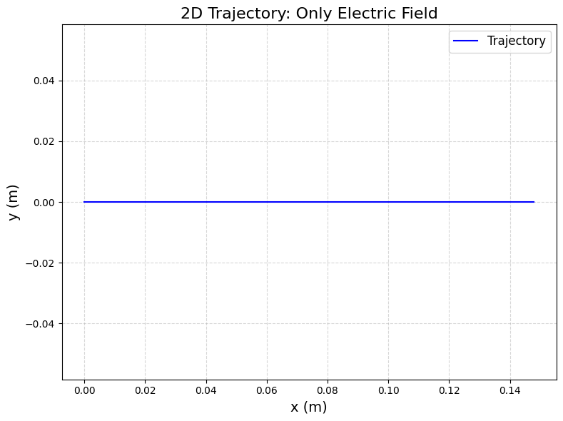
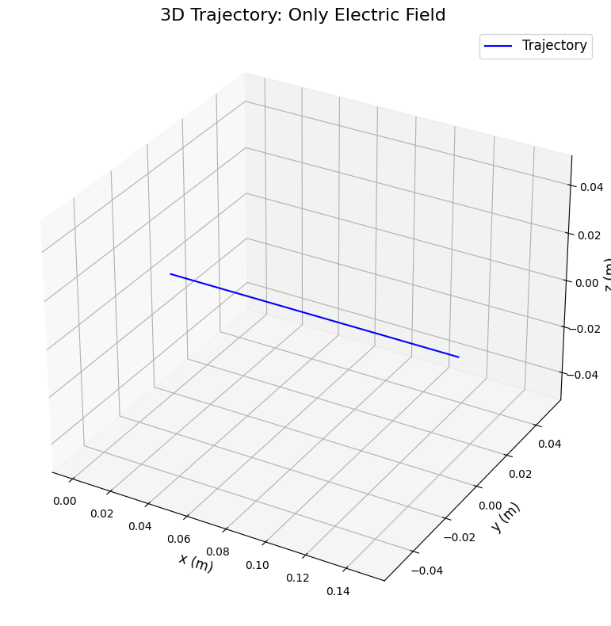
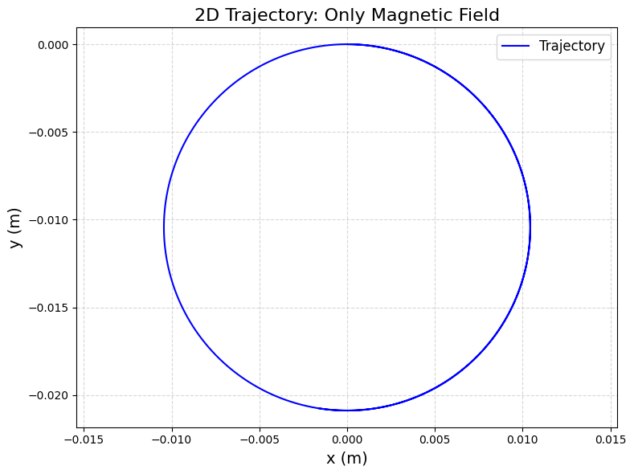
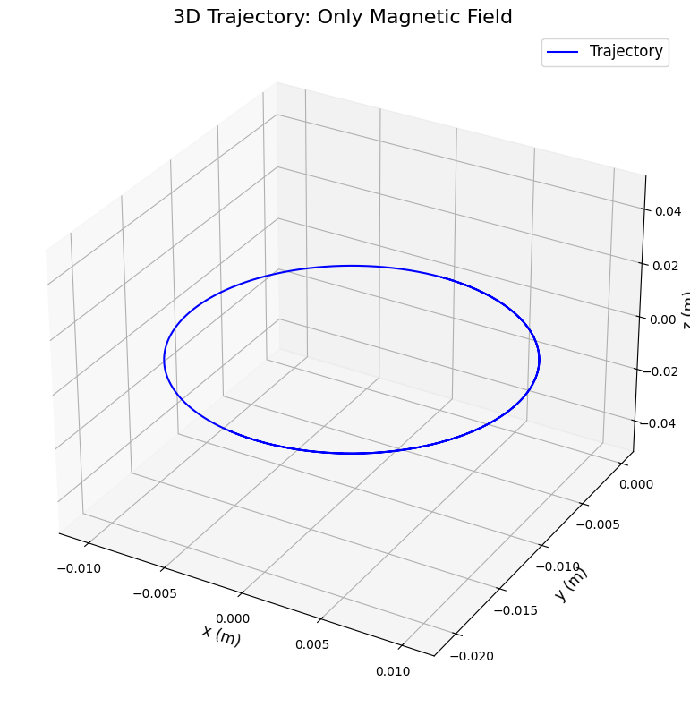
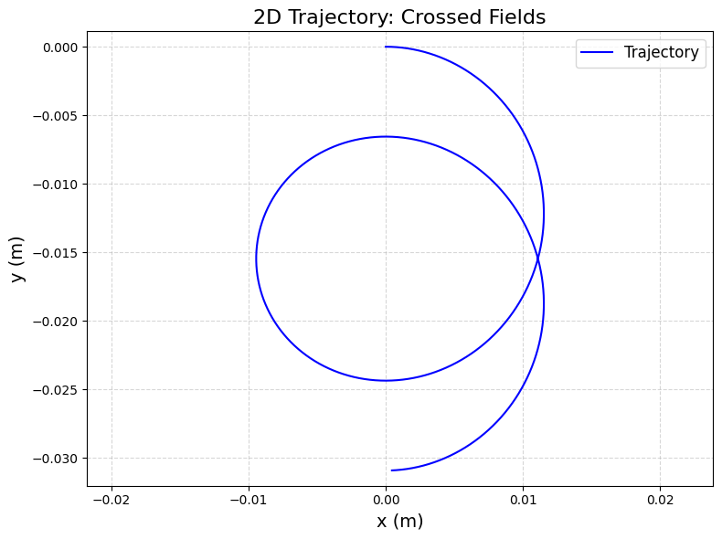
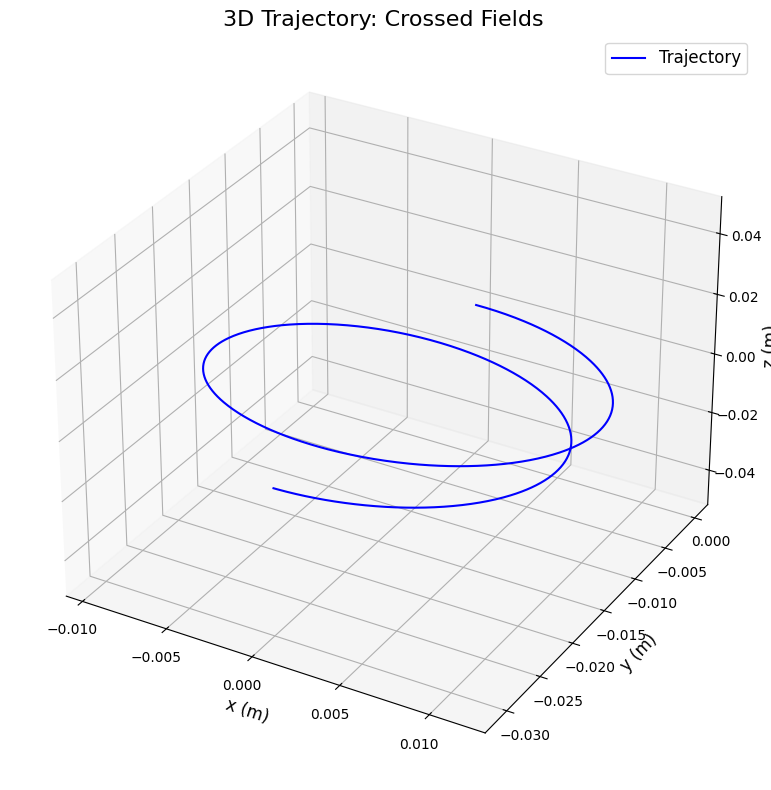
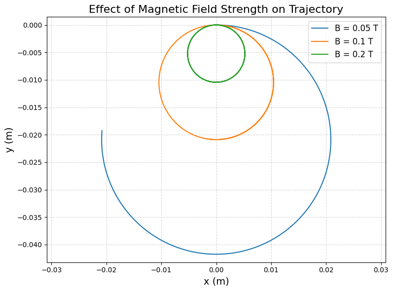

# Problem 1

# Simulating the Effects of the Lorentz Force

## 1. Understanding the Lorentz Force

The Lorentz force acts on a charged particle in electric and magnetic fields. It’s given by:
$$
\mathbf{F} = q(\mathbf{E} + \mathbf{v} \times \mathbf{B})
$$
- $q$: Charge of the particle (Coulombs)

- $\mathbf{E}$: Electric field (V/m)

- $\mathbf{v}$: Velocity of the particle (m/s)

- $\mathbf{B}$: Magnetic field (Tesla)

### Applications
- **Particle Accelerators:** The Lorentz force guides particles in devices like cyclotrons.

- **Mass Spectrometers:** It separates particles by mass and charge.

- **Astrophysics:** It explains how charged particles move in space (e.g., auroras).

### Role of Fields

- **Electric Field ($\mathbf{E}$):** Pushes the particle in the direction of the field.

- **Magnetic Field ($\mathbf{B}$):** Causes circular or helical motion perpendicular to both $\mathbf{v}$ and $\mathbf{B}$.

## 2. Simulating Particle Motion

We’ll simulate the motion of a charged particle under:
- A uniform electric field.

- A uniform magnetic field.

- Combined fields (crossed $\mathbf{E}$ and $\mathbf{B}$).

### Equations of Motion
Newton’s second law gives:
$$
\mathbf{F} = m \mathbf{a} \quad \Rightarrow \quad m \frac{d\mathbf{v}}{dt} = q(\mathbf{E} + \mathbf{v} \times \mathbf{B})
$$
Where:

- $m$: Mass of the particle (kg)

- $\mathbf{a}$: Acceleration (m/s²)

Divide by $m$:
$$
\frac{d\mathbf{v}}{dt} = \frac{q}{m} (\mathbf{E} + \mathbf{v} \times \mathbf{B})
$$
Position updates as:
$$
\frac{d\mathbf{r}}{dt} = \mathbf{v}
$$

## 3. Parameter Exploration

We’ll vary:
- **Field Strengths:** $\mathbf{E}$ and $\mathbf{B}$.

- **Initial Velocity:** $\mathbf{v}_0$.

- **Charge and Mass:** $q$ and $m$.

### Scenarios
1. **Only Electric Field:** $\mathbf{E} = (E_x, 0, 0)$, $\mathbf{B} = 0$.

2. **Only Magnetic Field:** $\mathbf{E} = 0$, $\mathbf{B} = (0, 0, B_z)$.

3. **Crossed Fields:** $\mathbf{E} = (E_x, 0, 0)$, $\mathbf{B} = (0, 0, B_z)$.

## 4. Python Implementation

Here’s the simulation using the Runge-Kutta method (via `scipy.integrate.odeint`):

```python
import numpy as np
import matplotlib.pyplot as plt
from scipy.integrate import odeint
from mpl_toolkits.mplot3d import Axes3D  # For 3D plotting

# Constants for the particle (e.g., a proton)
q = 1.6e-19  # Charge in Coulombs (proton charge)
m = 1.67e-27  # Mass in kg (proton mass)
E0 = 1e3  # Electric field strength in V/m
B0 = 0.1  # Magnetic field strength in Tesla

# Function to compute the motion (derivatives)
def lorentz_motion(state, t, q, m, E, B):
    """
    Compute the change in position and velocity.
    state = [x, y, z, vx, vy, vz]
    E = [Ex, Ey, Ez], B = [Bx, By, Bz]
    """
    x, y, z, vx, vy, vz = state
    v = np.array([vx, vy, vz])  # Velocity vector
    
    # Lorentz force: F = q(E + v x B)
    E_term = q * np.array(E) / m  # Acceleration from electric field
    B_term = q * np.cross(v, np.array(B)) / m  # Acceleration from magnetic field
    
    # Acceleration: dv/dt = (q/m)(E + v x B)
    ax, ay, az = E_term + B_term
    
    # Velocity: dx/dt = v
    return [vx, vy, vz, ax, ay, az]

# Time array for simulation
t = np.linspace(0, 1e-6, 1000)  # 1 microsecond, 1000 points

# Initial conditions: [x, y, z, vx, vy, vz]
initial_state = [0, 0, 0, 1e5, 0, 0]  # Start at origin, velocity along x (10^5 m/s)

# Define scenarios for different field setups
scenarios = {
    'Only Electric Field': {'E': [E0, 0, 0], 'B': [0, 0, 0]},
    'Only Magnetic Field': {'E': [0, 0, 0], 'B': [0, 0, B0]},
    'Crossed Fields': {'E': [E0, 0, 0], 'B': [0, 0, B0]}
}

# Simulate and plot for each scenario
for scenario, fields in scenarios.items():
    E, B = fields['E'], fields['B']
    # Solve the motion equations
    sol = odeint(lorentz_motion, initial_state, t, args=(q, m, E, B))
    x, y, z = sol[:, 0], sol[:, 1], sol[:, 2]  # Extract positions
    
    # 2D Plot (x-y plane)
    plt.figure(figsize=(8, 6), dpi=100)
    plt.plot(x, y, 'b-', label='Trajectory')
    plt.xlabel('x (m)', fontsize=14)
    plt.ylabel('y (m)', fontsize=14)
    plt.title(f'2D Trajectory: {scenario}', fontsize=16)
    plt.legend(fontsize=12)
    plt.grid(True, linestyle='--', alpha=0.5)
    plt.axis('equal')
    plt.tight_layout()
    # Save the plot as an image (optional, for downloading in Colab)
    plt.savefig(f'2D_{scenario.replace(" ", "_")}.png', dpi=100, bbox_inches='tight')
    plt.show()
    
    # 3D Plot
    fig = plt.figure(figsize=(8, 8), dpi=100)
    ax = fig.add_subplot(111, projection='3d')
    ax.plot(x, y, z, 'b-', label='Trajectory')
    ax.set_xlabel('x (m)', fontsize=12)
    ax.set_ylabel('y (m)', fontsize=12)
    ax.set_zlabel('z (m)', fontsize=12)
    ax.set_title(f'3D Trajectory: {scenario}', fontsize=16)
    ax.legend(fontsize=12)
    plt.tight_layout()
    # Save the 3D plot
    plt.savefig(f'3D_{scenario.replace(" ", "_")}.png', dpi=100, bbox_inches='tight')
    plt.show()

# Explore the effect of magnetic field strength on the trajectory
B_values = [0.05, 0.1, 0.2]  # Different magnetic field strengths
plt.figure(figsize=(8, 6), dpi=100)
for B_val in B_values:
    B = [0, 0, B_val]  # Magnetic field along z
    E = [0, 0, 0]  # No electric field
    sol = odeint(lorentz_motion, initial_state, t, args=(q, m, E, B))
    x, y = sol[:, 0], sol[:, 1]
    plt.plot(x, y, label=f'B = {B_val} T')
plt.xlabel('x (m)', fontsize=14)
plt.ylabel('y (m)', fontsize=14)
plt.title('Effect of Magnetic Field Strength on Trajectory', fontsize=16)
plt.legend(fontsize=12)
plt.grid(True, linestyle='--', alpha=0.5)
plt.axis('equal')
plt.tight_layout()
# Save the plot
plt.savefig('B_variation.png', dpi=100, bbox_inches='tight')
plt.show()

# Optional: Download the saved plots in Colab
from google.colab import files
for scenario in scenarios:
    files.download(f'2D_{scenario.replace(" ", "_")}.png')
    files.download(f'3D_{scenario.replace(" ", "_")}.png')
files.download('B_variation.png')

# Simulate and plot
for scenario, fields in scenarios.items():
    E, B = fields['E'], fields['B']
    sol = odeint(lorentz_motion, initial_state, t, args=(q, m, E, B))
    x, y, z = sol[:, 0], sol[:, 1], sol[:, 2]
    
    # 2D Plot (x-y plane)
    plt.figure(figsize=(8, 6), dpi=100)
    plt.plot(x, y, 'b-', label='Trajectory')
    plt.xlabel('x (m)', fontsize=14)
    plt.ylabel('y (m)', fontsize=14)
    plt.title(f'2D Trajectory: {scenario}', fontsize=16)
    plt.legend(fontsize=12)
    plt.grid(True, linestyle='--', alpha=0.5)
    plt.axis('equal')
    plt.tight_layout()
    plt.show()
    
    # 3D Plot
    fig = plt.figure(figsize=(8, 8), dpi=100)
    ax = fig.add_subplot(111, projection='3d')
    ax.plot(x, y, z, 'b-', label='Trajectory')
    ax.set_xlabel('x (m)', fontsize=12)
    ax.set_ylabel('y (m)', fontsize=12)
    ax.set_zlabel('z (m)', fontsize=12)
    ax.set_title(f'3D Trajectory: {scenario}', fontsize=16)
    ax.legend(fontsize=12)
    plt.tight_layout()
    plt.show()

# Parameter variation: Effect of B on Larmor radius
B_values = [0.05, 0.1, 0.2]  # Different magnetic field strengths
plt.figure(figsize=(8, 6), dpi=100)
for B_val in B_values:
    B = [0, 0, B_val]
    E = [0, 0, 0]  # Only magnetic field
    sol = odeint(lorentz_motion, initial_state, t, args=(q, m, E, B))
    x, y = sol[:, 0], sol[:, 1]
    plt.plot(x, y, label=f'B = {B_val} T')
plt.xlabel('x (m)', fontsize=14)
plt.ylabel('y (m)', fontsize=14)
plt.title('Effect of Magnetic Field on Trajectory', fontsize=16)
plt.legend(fontsize=12)
plt.grid(True, linestyle='--', alpha=0.5)
plt.axis('equal')
plt.tight_layout()
plt.show()
```

---







---

## 5. Outputs and Explanation

### 2D and 3D Trajectories
- **Only Electric Field:** The particle moves in a straight line along the x-axis (due to $\mathbf{E}$).

- **Only Magnetic Field:** The particle follows a circular path in the x-y plane (Larmor radius = $mv/(qB)$).

- **Crossed Fields:** The particle drifts in the y-direction while circling (drift velocity = $E/B$).

### Parameter Variation

- **Magnetic Field Strength:** Higher $B$ makes the Larmor radius smaller (tighter circles).

### Physical Phenomena
- **Larmor Radius:** The radius of the circular path in a magnetic field: $r = \frac{mv}{qB}$.

- **Drift Velocity:** In crossed fields, the particle drifts at $v_d = \frac{E}{B}$ in the direction perpendicular to both fields.

## 6. Discussion

- **Relation to Real Systems:** Cyclotrons use magnetic fields to keep particles in circular paths. Crossed fields are used in velocity selectors.

- **Extensions:** Add non-uniform fields or relativistic effects for more complex scenarios.