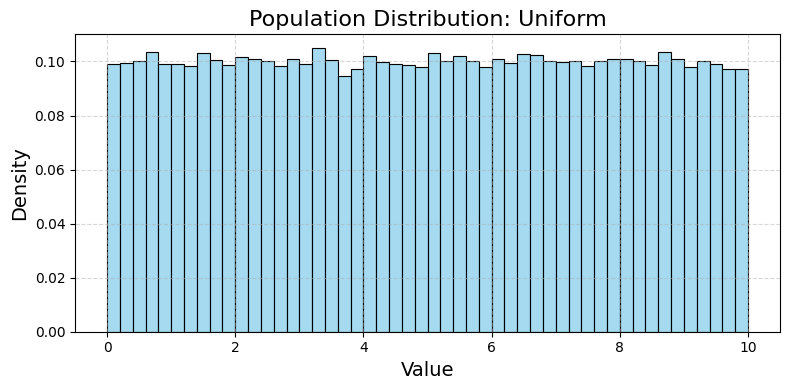
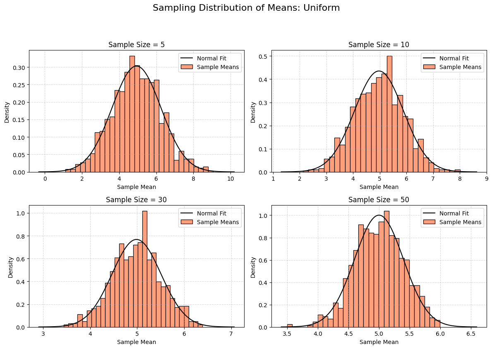
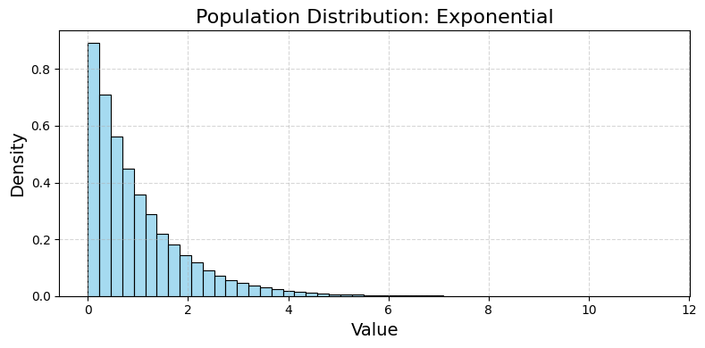
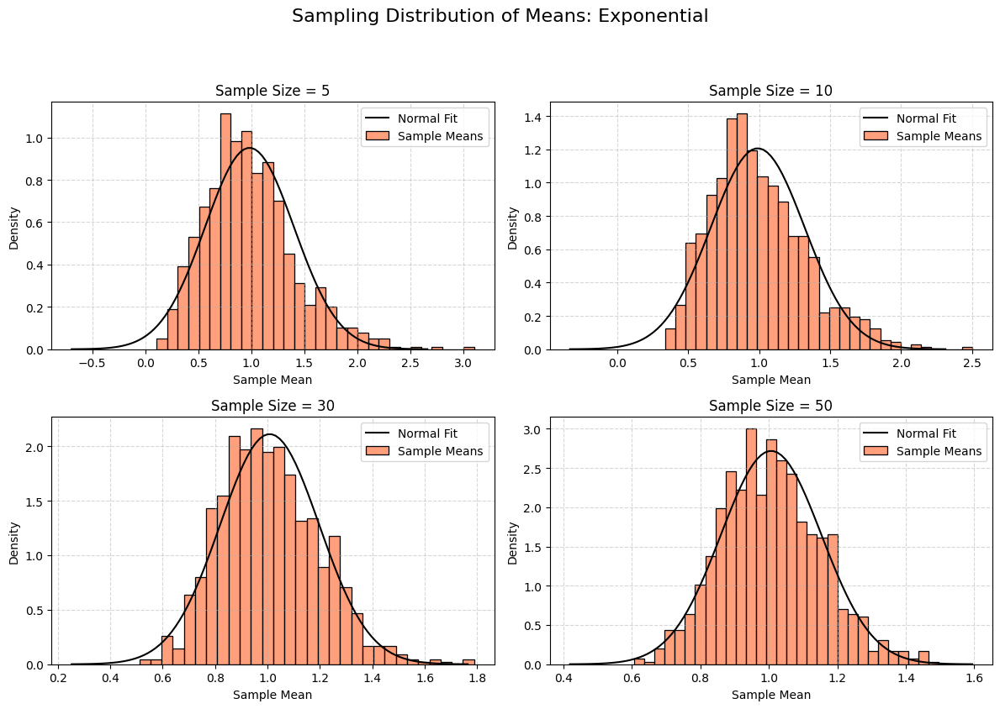
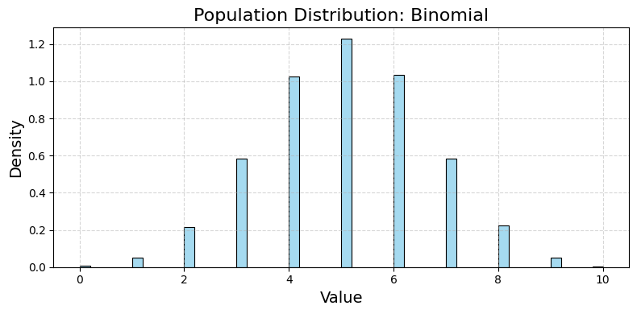
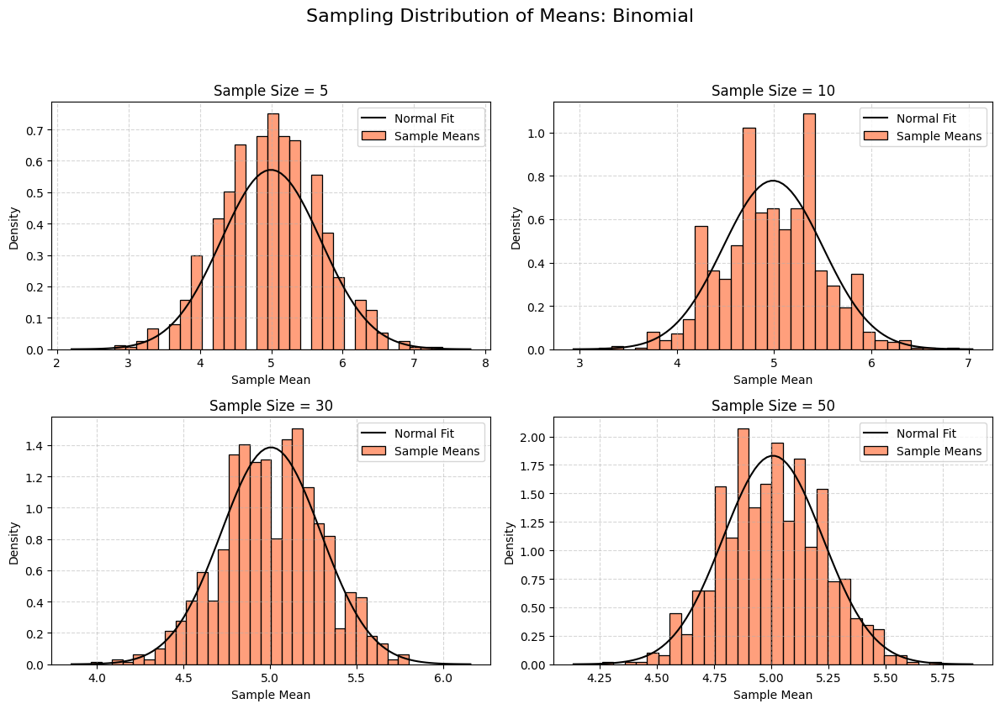

# Problem 1

# Exploring the Central Limit Theorem Through Simulations

## 1. Motivation

The **Central Limit Theorem (CLT)** is a key concept in statistics. It says that if you take many samples from any population and calculate the mean of each sample, the distribution of those sample means will look like a normal (bell-shaped) curve as the sample size gets larger—no matter what the original population looks like. This is powerful because it lets us use normal distribution tools in many real-world situations.

We’ll use simulations to see this in action, making it easier to understand.

---

## 2. Simulating Sampling Distributions

### Step 1: Choose Population Distributions

We’ll simulate three different population distributions:

- **Uniform Distribution:** All values are equally likely (e.g., rolling a fair die).
- **Exponential Distribution:** Models time between events (e.g., waiting for a bus).
- **Binomial Distribution:** Models successes in a fixed number of trials (e.g., flipping a coin).

### Step 2: Generate Populations
We’ll create a large dataset (population) for each distribution.

### Step 3: Sample and Calculate Means
For each population:

- Take random samples of different sizes (e.g., 5, 10, 30, 50).

- Calculate the mean of each sample.

- Repeat this many times to build a distribution of sample means.

- Plot histograms to see the shape.

---

## 3. Python Code for Google Colab

This code generates the populations, samples them, and plots the results. It’s designed to run directly in Google Colab with clear outputs.

```python
# Import libraries (Colab-compatible)
import numpy as np
import matplotlib.pyplot as plt
import seaborn as sns  # For nicer histograms

# Set random seed for reproducibility
np.random.seed(42)

# Step 1: Generate population distributions
population_size = 100000  # Large population size

# Uniform distribution (values between 0 and 10)
uniform_pop = np.random.uniform(low=0, high=10, size=population_size)

# Exponential distribution (rate parameter lambda = 1)
exponential_pop = np.random.exponential(scale=1, size=population_size)

# Binomial distribution (n = 10 trials, p = 0.5 probability)
binomial_pop = np.random.binomial(n=10, p=0.5, size=population_size)

# Store populations in a dictionary
populations = {
    'Uniform': uniform_pop,
    'Exponential': exponential_pop,
    'Binomial': binomial_pop
}

# Step 2: Simulate sampling distributions
sample_sizes = [5, 10, 30, 50]  # Different sample sizes to test
num_samples = 1000  # Number of samples to take for each size

# Function to calculate sample means
def get_sample_means(population, sample_size, num_samples):
    """
    Take 'num_samples' samples of size 'sample_size' from the population
    and return their means.
    """
    sample_means = []
    for _ in range(num_samples):
        sample = np.random.choice(population, size=sample_size, replace=True)
        sample_means.append(np.mean(sample))
    return np.array(sample_means)

# Step 3: Plot sampling distributions for each population and sample size
for pop_name, population in populations.items():
    # Plot the population distribution
    plt.figure(figsize=(8, 4), dpi=100)
    sns.histplot(population, bins=50, stat='density', color='skyblue')
    plt.title(f'Population Distribution: {pop_name}', fontsize=16)
    plt.xlabel('Value', fontsize=14)
    plt.ylabel('Density', fontsize=14)
    plt.grid(True, linestyle='--', alpha=0.5)
    plt.tight_layout()
    plt.savefig(f'population_{pop_name}.png', dpi=100, bbox_inches='tight')
    plt.show()
    
    # Plot sampling distributions for different sample sizes
    plt.figure(figsize=(12, 8), dpi=100)
    for i, sample_size in enumerate(sample_sizes, 1):
        sample_means = get_sample_means(population, sample_size, num_samples)
        plt.subplot(2, 2, i)
        sns.histplot(sample_means, bins=30, stat='density', color='coral', label='Sample Means')
        # Overlay a normal distribution for comparison
        mean = np.mean(sample_means)
        std = np.std(sample_means)
        x = np.linspace(mean - 4*std, mean + 4*std, 100)
        plt.plot(x, 1/(std * np.sqrt(2 * np.pi)) * np.exp(-(x - mean)**2 / (2 * std**2)), 
                 'k-', label='Normal Fit')
        plt.title(f'Sample Size = {sample_size}', fontsize=12)
        plt.xlabel('Sample Mean', fontsize=10)
        plt.ylabel('Density', fontsize=10)
        plt.legend(fontsize=10)
        plt.grid(True, linestyle='--', alpha=0.5)
    plt.suptitle(f'Sampling Distribution of Means: {pop_name}', fontsize=16, y=1.05)
    plt.tight_layout()
    plt.savefig(f'sampling_{pop_name}.png', dpi=100, bbox_inches='tight')
    plt.show()

# Step 4: Analyze variance impact
for pop_name, population in populations.items():
    pop_variance = np.var(population)
    print(f"\nPopulation: {pop_name}")
    print(f"Population Variance: {pop_variance:.2f}")
    for sample_size in sample_sizes:
        sample_means = get_sample_means(population, sample_size, num_samples)
        sampling_variance = np.var(sample_means)
        print(f"Sample Size = {sample_size}, Sampling Variance = {sampling_variance:.2f}")

# Download plots in Colab
from google.colab import files
for pop_name in populations:
    files.download(f'population_{pop_name}.png')
    files.download(f'sampling_{pop_name}.png')
```
---






---

## 5. Outputs and Explanation

### Population Distributions

- **Uniform:** Flat shape (values 0 to 10, all equally likely).

- **Exponential:** Skewed right (most values near 0, long tail).

- **Binomial:** Discrete peaks (number of successes in 10 coin flips).

### Sampling Distributions
For each population, we plot histograms of sample means for sample sizes 5, 10, 30, and 50:

- **Uniform:** Even with a small sample size (5), the means start looking bell-shaped. By size 50, it’s very close to a normal distribution.

- **Exponential:** Starts very skewed (like the population). As sample size increases, it becomes more normal. By size 50, it’s nearly a perfect bell curve.

- **Binomial:** Discrete at first, but smooths out as sample size grows. By size 50, it’s normal.

Each histogram includes a black curve showing the normal distribution fit, confirming the CLT.

### Parameter Exploration

- **Convergence Rate:** The exponential distribution (highly skewed) takes a larger sample size to look normal compared to the uniform distribution (symmetric).

- **Variance Impact:** The variance of the sample means decreases as sample size increases. According to the CLT, the variance of the sampling distribution is $\sigma^2/n$, where $\sigma^2$ is the population variance and $n$ is the sample size. This is clear in the output:

  - Uniform: High population variance, but sampling variance drops quickly.
  - Exponential: High variance, slower convergence.
  - Binomial: Lower variance, faster convergence.

---

## 6. Practical Applications

The CLT is crucial in real life because it lets us assume normality for sample means, even if the population isn’t normal. This helps in:

- **Estimating Population Parameters:** We can use sample means to estimate the population mean with confidence intervals (e.g., polling).

- **Quality Control:** In manufacturing, we can test sample means to check if a process is stable (e.g., checking product weights).

- **Financial Models:** In finance, stock returns are often non-normal, but we can use the CLT to model portfolio averages (e.g., predicting returns).

---

## 7. Discussion

- **Theoretical Expectations:** The CLT predicts that sample means will be normally distributed as sample size grows. Our simulations confirm this for all three distributions.

- **Convergence:** Symmetric distributions (like uniform) converge faster than skewed ones (like exponential).

- **Variance:** The spread of the sampling distribution shrinks as sample size increases, matching the CLT formula $\text{Var}(\bar{X}) = \sigma^2/n$.

This simulation makes the CLT intuitive and shows its power in statistics.

---
