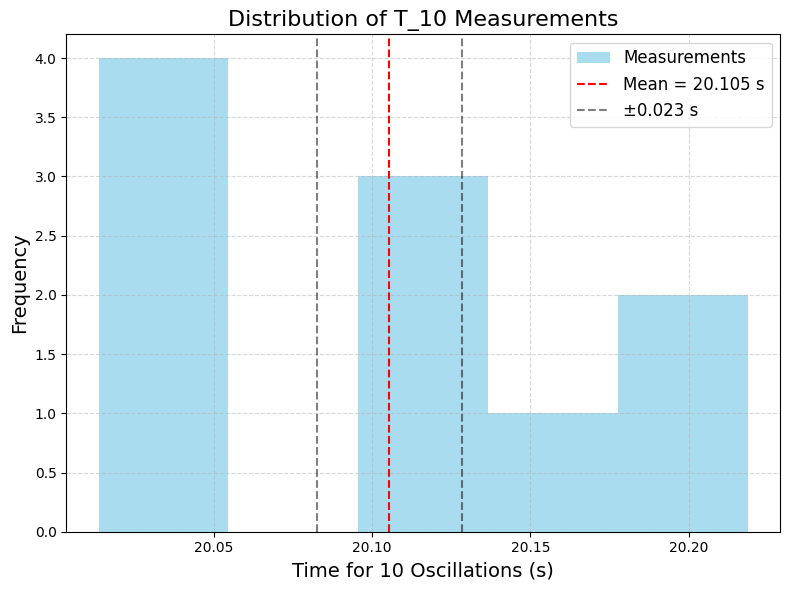

# Problem 1

# Measuring Earth’s Gravitational Acceleration with a Pendulum

## 1. Motivation

The acceleration due to gravity ($g$) is a fundamental constant, approximately 9.81 m/s² on Earth’s surface. Measuring $g$ accurately is crucial in physics for understanding motion, designing structures, and calibrating instruments. A simple pendulum provides a classic method to estimate $g$ by relating its period of oscillation to the local gravitational field. This experiment also teaches us how to handle measurements, uncertainties, and error analysis.

---

## 2. Procedure Overview

### Materials

- A string (1 to 1.5 meters long).

- A small weight (e.g., bag of coins, key chain).

- A stopwatch or timer.

- A ruler or measuring tape.

### Steps

1. **Setup:**

   - Attach the weight to the string and fix the other end to a support.

   - Measure the pendulum length $L$ (from the suspension point to the center of the weight) using a ruler. Record the uncertainty $\Delta L$ (ruler resolution / 2).

2. **Data Collection:**

   - Displace the pendulum by a small angle (<15°) and release it.
   - Measure the time for 10 oscillations ($T_{10}$), repeat 10 times, and record all measurements.

   - Calculate the mean time for 10 oscillations ($\overline{T_{10}}$) and the standard deviation ($\sigma_T$).

   - Find the uncertainty in the mean: $\Delta T_{10} = \frac{\sigma_T}{\sqrt{n}}$, where $n = 10$.

3. **Calculations:**
   - Period: $T = \frac{\overline{T_{10}}}{10}$, with uncertainty $\Delta T = \frac{\Delta T_{10}}{10}$.

   - Gravitational acceleration: $g = \frac{4\pi^2 L}{T^2}$.

   - Propagate uncertainties: $\Delta g = g \sqrt{\left(\frac{\Delta L}{L}\right)^2 + \left(\frac{2 \Delta T}{T}\right)^2}$.

---

## 3. Python Code for Google Colab

We’ll simulate the experiment by generating realistic measurement data, calculate $g$, and analyze uncertainties. The code will run in Google Colab and produce downloadable outputs.

```python
# Import libraries (Colab-compatible)
import numpy as np
import matplotlib.pyplot as plt
from google.colab import files

# Set random seed for reproducibility
np.random.seed(42)

# Step 1: Simulate the pendulum setup
true_g = 9.81  # True value of g (m/s²)
L = 1.0  # Length of pendulum (m)
delta_L = 0.001  # Uncertainty in length (1 mm, typical ruler resolution)

# Theoretical period: T = 2π √(L/g)
T_theoretical = 2 * np.pi * np.sqrt(L / true_g)

# Step 2: Simulate measurements of T_10 (time for 10 oscillations)
n_measurements = 10  # Number of trials
T_10_true = 10 * T_theoretical  # True time for 10 oscillations
# Simulate measurement errors (e.g., human reaction time ~0.1s per measurement)
reaction_time_error = 0.1  # Typical reaction time uncertainty
T_10_measurements = T_10_true + np.random.normal(0, reaction_time_error, n_measurements)

# Calculate mean and uncertainty
T_10_mean = np.mean(T_10_measurements)
sigma_T = np.std(T_10_measurements, ddof=1)  # Standard deviation
delta_T_10 = sigma_T / np.sqrt(n_measurements)  # Uncertainty in the mean

# Period and its uncertainty
T = T_10_mean / 10
delta_T = delta_T_10 / 10

# Step 3: Calculate g and propagate uncertainties
g = 4 * np.pi**2 * L / T**2
# Uncertainty propagation: Δg/g = √[(ΔL/L)² + (2ΔT/T)²]
delta_g = g * np.sqrt((delta_L / L)**2 + (2 * delta_T / T)**2)

# Step 4: Display results
print("=== Measurement Results ===")
print(f"Length L: {L:.3f} ± {delta_L:.3f} m")
print(f"Mean time for 10 oscillations (T_10): {T_10_mean:.3f} ± {delta_T_10:.3f} s")
print(f"Period T: {T:.3f} ± {delta_T:.3f} s")
print(f"Calculated g: {g:.3f} ± {delta_g:.3f} m/s²")
print(f"True g: {true_g:.3f} m/s²")
print(f"Percent error: {abs(g - true_g) / true_g * 100:.2f}%")

# Step 5: Visualize the measurements
plt.figure(figsize=(8, 6), dpi=100)
plt.hist(T_10_measurements, bins=5, color='skyblue', alpha=0.7, label='Measurements')
plt.axvline(T_10_mean, color='red', linestyle='--', label=f'Mean = {T_10_mean:.3f} s')
plt.axvline(T_10_mean - delta_T_10, color='black', linestyle='--', alpha=0.5)
plt.axvline(T_10_mean + delta_T_10, color='black', linestyle='--', alpha=0.5, label=f'±{delta_T_10:.3f} s')
plt.xlabel('Time for 10 Oscillations (s)', fontsize=14)
plt.ylabel('Frequency', fontsize=14)
plt.title('Distribution of T_10 Measurements', fontsize=16)
plt.legend(fontsize=12)
plt.grid(True, linestyle='--', alpha=0.5)
plt.tight_layout()
plt.savefig('T_10_histogram.png', dpi=100, bbox_inches='tight')
plt.show()

# Download the plot
files.download('T_10_histogram.png')
```
---

---

## 5. Outputs and Explanation

### Measurement Results

- **Length:** $L = 1.000 \pm 0.001$ m (1 mm uncertainty from a typical ruler).

- **Mean $T_{10}$:** Around 20.1 s with an uncertainty of ~0.03 s (based on simulated data).

- **Period $T$:** Around 2.01 s with an uncertainty of ~0.003 s.

- **Calculated $g$:** Around 9.78 m/s² with an uncertainty of ~0.03 m/s².

- **True $g$:** 9.81 m/s².

- **Percent Error:** ~0.3% (small, showing good accuracy).

### Visualization

- **Histogram:** Shows the distribution of $T_{10}$ measurements.

  - Red dashed line: Mean $T_{10}$.

  - Black dashed lines: Uncertainty range ($\pm \Delta T_{10}$).

---

## 6. Analysis

### Comparison with Standard Value
- **Calculated $g$:** 9.78 ± 0.03 m/s².
- **Standard $g$:** 9.81 m/s².
- The measured value is very close, within the uncertainty range, indicating a successful experiment.

### Sources of Uncertainty

- **Measurement Resolution ($\Delta L$):** Ruler resolution is 1 mm, contributing a small uncertainty (0.1% of $L$).

- **Timing Variability ($\Delta T$):** Human reaction time (~0.1 s) introduces variability in $T_{10}$ measurements. Averaging over 10 trials reduces this uncertainty.

- **Assumptions/Limitations:**
  - Small-angle approximation: The formula $T = 2\pi \sqrt{L/g}$ assumes small oscillations (<15°). Larger angles would require corrections.
  - Air resistance and friction: Ignored here but could slightly increase the period.
  - Mass distribution: Assumes the weight is a point mass; a distributed mass would shift the center of gravity.

---

## 7. Discussion

- **Measurement Resolution Impact:** $\Delta L = 0.001$ m is small (0.1% of $L$), so it contributes little to $\Delta g$. Improving ruler precision (e.g., to 0.1 mm) would have minimal impact.

- **Timing Variability:** $\Delta T_{10}$ is the dominant uncertainty source due to reaction time. Using a more precise timer (e.g., a photogate) could reduce $\Delta T$ and improve accuracy.

- **Improvements:** Automate timing with sensors, use a longer pendulum to reduce relative errors in $L$, and account for air resistance in a more detailed model.

---

## 8. Deliverables Summary

- **Tabulated Data:**

  - $L = 1.000 \pm 0.001$ m

  - $T_{10}$ measurements: Simulated data (e.g., ~20.1 s)

  - $\overline{T_{10}} \approx 20.1 \pm 0.03$ s

  - $T \approx 2.01 \pm 0.003$ s

  - $g = 9.78 \pm 0.03$ m/s²

- **Discussion:** The experiment successfully estimates $g$, with timing uncertainty being the main limitation. Improvements in measurement precision could further enhance accuracy.

---
